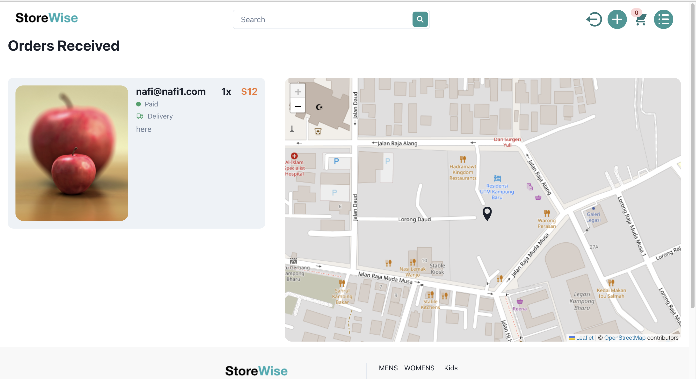

## How to run:

- Install docker

- Make a new file named `config.env` on the directory `{project root directory}/backend/`, and copy the contents from `example.config.env` onto it, and fill in the blanks of the copied contents. You need to setup the required environment variables. 

- Go to the root project directory and run `docker-compose up`

- Go to url `http://localhost:3000/`. Done!! Super simple since it's already dockerized.

## Features

These are the login pages and the sign-up pages for the respective users: buyers and sellers, to authenticate the user before they can user the other functionalities of the application. The illustration of page navigation for the different services are shown below. The authentication of the system is secure, as the passwords are encrypted, stored on the cloud. 

The figure below shows the home page for the users. The categories can be filtered based on the tags, and the page re-renders part of the page, to show the filtered categories. 

The figure below shows the page for buyers after they have selected a category, which shows the details of a category, and they can add it to the cart.

The figure below shows the user interface for products after they are added to the cart. The page shows the location that the buyer can update (so that seller can deliver the category based on buyer's location), and buyer pays up the amount. The system uses the Stripe API, for payment gateway, securely implemented. The map that is used, is openstreetmap, an open source map. 

The figure below shows the user interface for sellers to add products to have them get sold.

The figure below shows the user interface for viewing the list of orders a seller has received (after buyers bought products). The map shows where the user is located, to deliver the category (that the buyer inputted while buying them).

